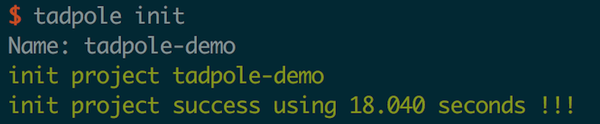
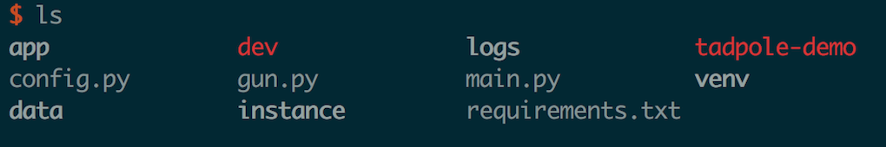
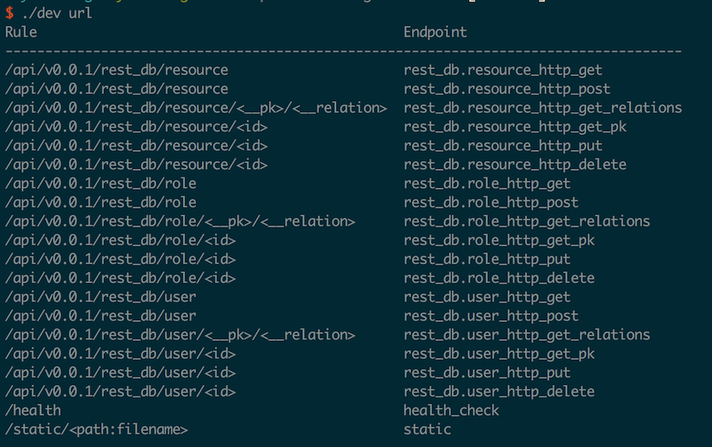
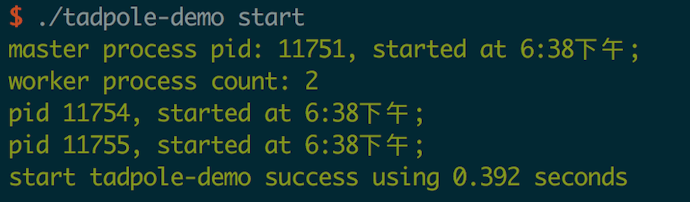
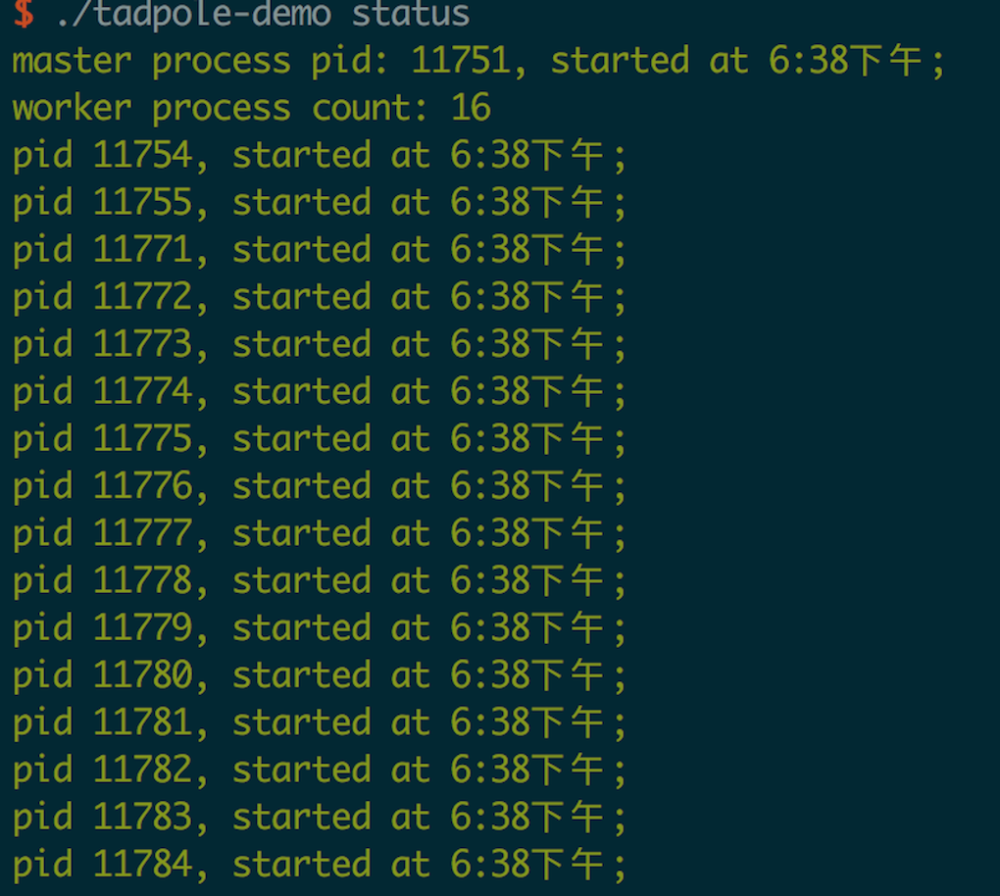
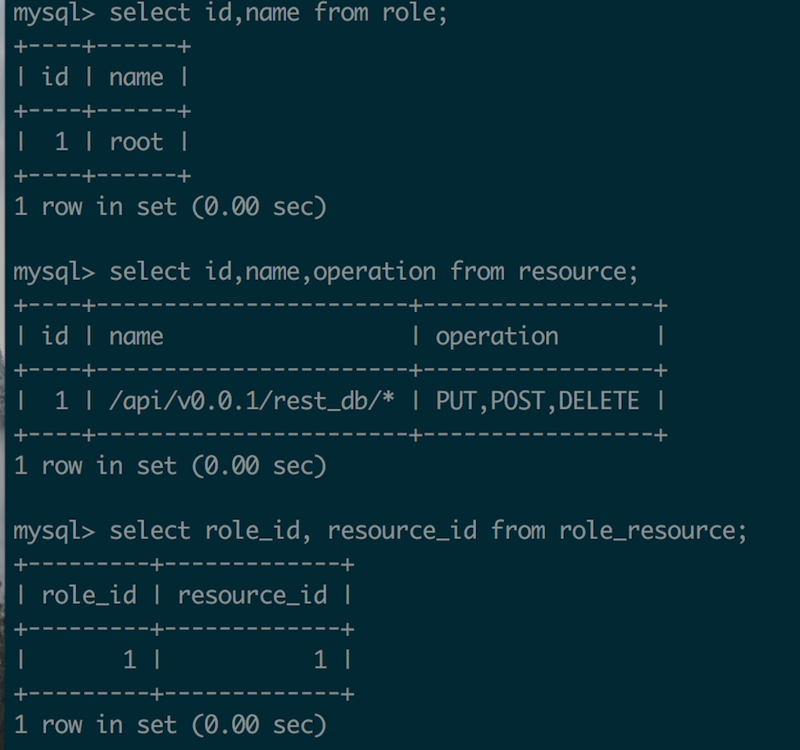
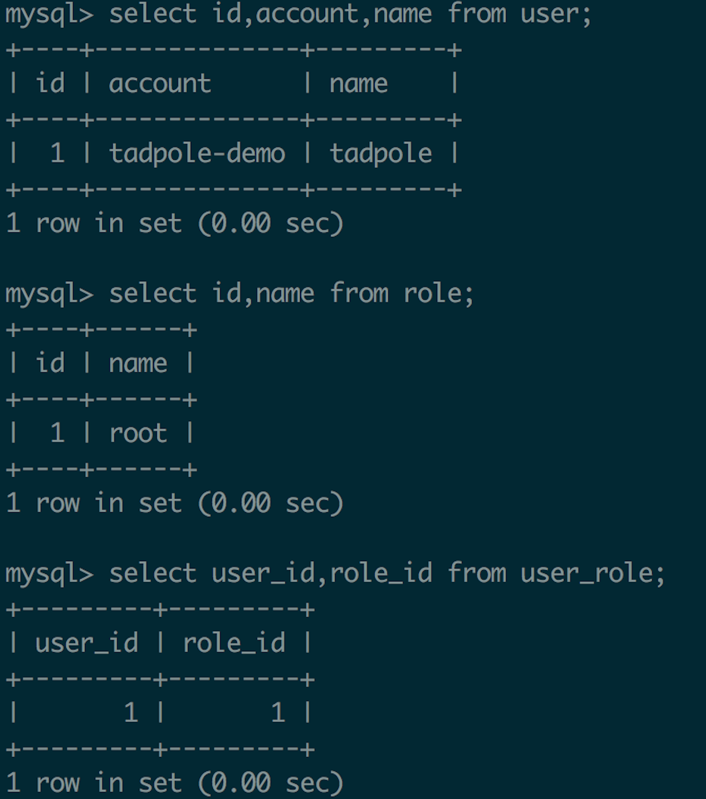

# tadpole 文档

> tadpole 是一个flask starter 项目。从平时flask项目的开发过程中提出来的一些通用的功能,如通过gunicorn管理flask应用的配置文件和启动脚本,初始化virtualenv环境同时安装必要的依赖库,生成flask secret以及提供restful route, 自动为sqlalchey model注册restful接口, 登录认证,权限管理, restful支持等等技能。

## 一、系统和环境要求

`posix, Python 2.x >= 2.6`

## 二、 安装方法

`pip install tadpole`

## 三、 使用方法
`tadpole init -n PROJECT_NAME -v PROJECT_VERSION -o PROJECT_OWNER -e PROJECT_EMAIL`

其中`PROJECT_NAME`是初始化的项目名,`PROJECT_VERSION`是初始化的版本号(默认为0.0.1), `PROJECT_OWNER`为项目负责人,
`PROJECT_EMAIL`为项目邮件组(用于接收邮件)。

也可以直接执行`tadpole init` 会提示填入项目名,其他采用默认, 例如:

## 四、项目结构

至此,已经使用tadpole初始化了一个新的flask项目,进入tadpole-demo目录可以看到

* requirements.txt 新项目依赖第三方库列表(其中包含了flask项目常用依赖库)
* venv 为新项目生成的virtualenv 环境,其中已经安装了requirements.txt中声明的依赖项
* main.py 项目入口文件,其中定义了Flask app
* app 主要代码目录
* config.py 配置文件(会上传git,主要包含不涉秘配置项)
* instance 其中由instance/config.py, 本地配置项,已经加入.gitignore, 不会上传git,其中为涉密配置或本地特殊配置,其中配置可以覆盖config.py中配置
* gun.py gunicorn配置文件
* data 项目数据目录,已经加入.gitignore
* logs 项目日志目录,已经加入.gitignore
* dev 本地调试管理脚本,由于具有项目的所有权限,因此已经加入.gitignore,仅供本地调试
* tadpole-demo 以项目名gunicorn管理脚本,提供了gunicorn启动/停止/重新加载等技能

## 五、管理脚本的使用

### 5.1 dev的使用
dev是提供给开发者在开发环境下使用的工具,其中提供了如下技能

* create_db: 根据model自动生成表结构
* url: 展示所有注册url
* clean: 删除项目目录下所有pyc,pyo文件
* shell: 以命令行方式侵入应用
* runserver: 使用flask内置的web服务器在5000端口启动应用

此处仅以 url 为例:

可以看到新初始化的项目已经有这么多注册的url了,其中prefix为/api/v0.0.1/rest_db开头的url都是为已经创建的
user,role,resource三张表自动生成的restful api。另外一个/health则用于健康检查。最后的/static/则是flask默认提供的。

### 5.2 tadpole-demo的使用
* start 用gunicorn启动flask应用,如:

* status 用于显示gunicorn应用状态,如:

* stop 用于停止gunicorn应用
* reload 用于重新加载gunicorn配置文件,同时重新启动worker进程(目前只支持linux,不支持mac)

## 六、提供的基本技能

### 6.1 sqlalchemy restful model
工作中经常会有人要接口查询数据,但是很多数据只需要执行sql语句就能拿到数据,但是又不能直接把DB权限给别人,
因此提供了一个把简单sql语句自动对应到restful查询的技能。这个技能实际上市面上已经有很多库提供了,但是
并没有遇到让我自己用的很舒服的库,因此自己写了一个,这个技能之只需要用户写Model类,并直接或间接的
import到app/models/__init__.py中即可为其自动注册restful接口。

为了初始化出来的项目可以开箱即用, 会给默认的db(sqlite数据库,文件位于app.db)中创建user,role,resource等
表结构,同时会插入部分数据,因此访问已经注册的rest_db url是可以直接拿到数据的, 例如:

	curl http://127.0.0.1:8080/api/v0.0.1/rest_db/user 
	
	{
	    "code": 200,
	    "msg": "ok",
	    "result": {
	        "next_page": "http://127.0.0.1:8080/api/v0.0.1/rest_db/user?__page=2&__page_size=200",
	        "page": 1,
	        "page_size": 200,
	        "prev_page": null,
	        "result": [
	            {
	                "__roles_link": "http://127.0.0.1:8080/api/v0.0.1/rest_db/user/1/roles",
	                "account": "tadpole",
	                "create_time": "2017-11-26 17:53:13",
	                "email": "tadpole@tadpole.com",
	                "id": 1,
	                "name": "tadpole"
	            }
	        ]
	    }
    }

可以看到user表已经有一条记录了,同时__roles_link链接到了每个用户所拥有的角色，直接访问可以看到

	curl http://127.0.0.1:8080/api/v0.0.1/rest_db/user/1/roles 
	
	
	{
		  "msg": "ok",
		  "code": 200,
		  "result": {
		    "next_page": "http://127.0.0.1:8080/api/v0.0.1/rest_db/user/1/roles?__page=2&__page_size=200",
		    "prev_page": null,
		    "result": [
		      {
		        "description": "super admin",
		        "__resources_link": "http://127.0.0.1:8080/api/v0.0.1/rest_db/role/1/resources",
		        "__users_link": "http://127.0.0.1:8080/api/v0.0.1/rest_db/role/1/users",
		        "create_time": "2017-11-26 17:42:52",
		        "id": 1,
		        "name": "root"
		      }
		    ],
		    "page_size": 200,
		    "page": 1
		 }
	}
	
可以看到tadpole这个用户已经拥有了一个root角色, 每一条记录除了返回自己的的列之外还以`__{relation}_link`的形式返回了其关联关系的链接。

#### 6.1.1 支持的查询条件

	 OPERATORS = ('lt', 'le', 'gt', 'ge', 'eq', 'like', 'in', 'between')
    PROCESSES = ('__show', '__order')
    PAGINATE = ('__page', '__page_size')

    
查询条件分为3类,一类是基本的运算符在OPERATORS中,另一类是对查询的数据进行一些处理,如排序、只展示部分列等,另一类则是分页。
联合使用这些查询条件:

	
	curl http://127.0.0.1:5000/api/v0.0.1/rest_db/user?name=tadpole&account.like=tad%&__show=account,email&__order=id.asc,name.desc	
	{
	  "msg": "ok",
	  "code": 200,
	  "result": {
	    "next_page": "http://127.0.0.1:5000/api/v0.0.1/rest_db/user?name=tadpole&__page_size=200&__page=2&account.like=tad%25&__order=id.asc%2Cname.desc&__show=account%2Cemail",
	    "prev_page": null,
	    "result": Array[1][
	      {
	        "account": "tadpole",
	        "email": "tadpole@tadpole.com"
	      }
	    ],
	    "page_size": 200,
	    "page": 1
	  }
	}

可以看到仅仅返回了`__show`中列出的列,而且按照`name=tadpole,account.like=tad%`过滤的结果,并且根据`__order`中的排序条件进行了排序。

#### 6.1.2 url规则
可以看出生成的url都是有一定规则的, prefix为/api/v0.0.1,其中v0.0.1是项目的版本号,但是这个是可以定制的。通过配置文件中的`BP_PREFIX`就可以配置每一个bluprint对应的prefix,例如rest_db这个blueprint(即rest model使用的)的配置可以如下:

	BP_PREFIX = {
    'rest_db': '/api/{0}/rest_db/'.format(VERSION)
	}
	

除了prefix之外,后面紧跟着的则是表名,如果是关联查询则是`{prefix}/{table_name}/{pk_id}/{relation_name}`

#### 6.1.3 自动隐藏
并不是所有的列都适合展示,有些列(比如密码,并不适合对外开放),初始化出来的项目对user表的password列就做了隐藏,如下:

	class User(Model):

    # columns in __hide__ does'nt show in rest_db
    __hide__ = ('password',)

    account = Column(
        db.String(128),
        nullable=False,
        default=u'-',
        index=True,
        unique=True)
    name = Column(db.String(32), nullable=False, default=u'-')
    email = Column(db.Email(128), nullable=False, default=u'-')
    password = Column(db.Password(schemes=['pbkdf2_sha512', 'md5_crypt'],
                                  deprecated=['md5_crypt']), nullable=False, default=u'-')

声明Model时, `__hide__`元组中的列不会在自动生成的restful接口中展示

### 6.2 登录控制和权限管理

对于每一个应用来说,都有不适合对所有人开放的资源,因此需要登录控制和权限管理。tadpole默认在app/models/auth包中实现了用户和权限依赖的Model,
在app/lib/auth.py中实现了有关登录和权限验证的逻辑。登录验证目前采用的是`Http Basic`认证, 因为密码是单向加密存储的,所以有些验证方法(如`Http Digest`)不能直接使用,有需求可以对代码进行扩展。扩展也十分容易,有兴趣的朋友可以阅读实现源码进行扩展。权限校验则是简单的查询数据库看用户有没有对某一资源执行某一操作的权限(此处也可以很容易扩展自己的校验方式),权限校验默认对restful接口的http method进行了支持,因此只需要在数据库中添加合适的记录既可以做到接口的权限控制。为了应用可以开箱即用,已经对`/api/v0.0.1/rest_db/`开头的url做了权限限制,其`POST,DELETE,PUT`方法仅有root权限用户可以操作,如:

对于新初始化的项目,已经添加了`account=tadpole-demo,password=12qwaszx`的用户,并且赋予了root角色,可以执行`POST /api/v0.0.1/rest_db/*`测试权限校验是否正确。

只需要把resource 和 role关联起来即可以仅开放给对应角色的用户。数据库中没有记录的resource以及没有关联role的resource是对所有人开放的。一个资源开放给的用户是资源名称可以正则匹配的到所有`resource.name`,且对资源的操作在`resource.operation`(用','分割)中的资源列表所开放给的角色所拥有的用户。 例如对于http restful接口的权限校验, 会拿出所有匹配path 和 method的resource,然后查询这些resource开放的role列表,要求用户只有满足所有这些role,才可以访问对应接口。

### 6.3 关于rest_route

对于restful接口来说, 一是参数的校验几乎都需要,二是希望可以返回python对象,由框架自动处理成json格式。rest_route对这些做了支持。
如:

	from main import app

	validator = {
	    'required': ['user_name']
	}
	
	
	@app.rest_route('/welcome', methods=['GET'], validator=validator)
	def welcome(data):
	    return 'hell0', data['user_name']

首先validator中可以对参数进行校验,默认实现了几种常用校验,也可以自己扩充,除此之外还实现了custom校验,即传入用户自己的校验函数,这段代码提供了对user_name参数必填的校验。除此之外,为了提供统一的提交数据入口,所有提交数据都被merge到data参数中了,rest_route接口的POST方法必须提交json格式数据。最后返回一个元组,在rest_route中会自动将其转化为json list,请求这个接口返回如下:

	curl http://127.0.0.1:5000/welcome
	
	
	{
	  "msg": "param user_name is required",
	  "code": 400
	}

	curl http://127.0.0.1:5000/welcome?user_name=tadpole
	
	{
	  "msg": "ok",
	  "code": 200,
	  "result": Array[2][
	    "hell0",
	    "tadpole"
	  ]
	}

返回结果不仅支持直接返回元组,还支持sqlalchemy查询结果直接返回,set返回等等。对于用户自定义的对象如果要支持直接返回,只需要实现to_dict/_as_dict方法将对象转化成dict即可。

### 6.3.1 默认支持的参数校验方式

参数校验是通过app/lib/validator实现的,有兴趣的朋友可以直接看源码,实现很简单,也可以自己扩展。目前实现的校验方式有以下:

* required: 必填参数列表, 用户必须填充但可以为空字符串. 数据类型为list
* nonempty: 必填且不能为空参数列表。数据类型为list
* types: 参数类型校验, 数据类型为dict,例如:

		validator = {
		    'types': {
		    	'age': int,
		    	'active': bool,
		    }
		}
	
* oneof: 如果参数名称位于oneof中,其值必须要属于`oneof[param_name]`中的一个,数据类型为dict
* unique: 对list类型参数做去重,数据类型为list
* length: 对参数长度组校验, 数据类型为dict
* default: 对参数提供默认值, 数据类型为list
* override: 用对参数处理后的结果取代参数的值,数据
* custom: 用户自定义校验方法,数据类型为list

例如:

	validator = {
	    'required': ['task_id'],  # 必填参数
	
	    'nonempty': ['project', 'env', 'ip_list', 'component'], # 不能为空
	
	    'types': {
	        'ip_list': list,
	        'mem': int
	    },
	    
	    'unique': ['ip_list'], # 对ip_list参数去重
	
	    'default': {
	        'region': 'Shanghai' # 如果用户没有填写region参数,则用Shanghai填充
	    },
	
	    'oneof': {
	        'region': ['Shanghai', 'Beijing'], # region参数必属于Shanghai和Beijing之一
	    }
	}

### 6.3.2 关于异常处理

已经实现了异常的自动捕捉,并返回合适的信息,默认提供的异常在app/lib/exceptions.py中,
所有继承自CustomError的异常都会被捕捉,并且返回msg作为错误信息,code作为返回码,因此可以直接抛出这些异常给用户,
不需要再进行处理。也可以扩展自定义的异常。默认异常定义示例:

	class CustomError(Exception):

    def __init__(self, msg):
        super(CustomError, self).__init__(msg)
        self.msg = msg
        self.code = 500

    def to_dict(self):
        return dict(code=self.code, msg=self.msg)

    def __unicode__(self):
        return unicode(self.msg)

    def __str__(self):
        return str(self.msg)

	class InternalError(CustomError):
	
	    def __init__(self, msg):
	        super(InternalError, self).__init__(msg)
	        self.code = 500

